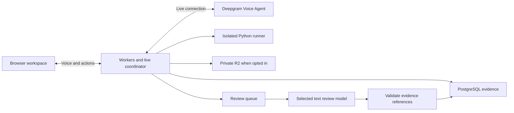

# AI interviewer MVP implementation handoff

This is the consolidated implementation and infrastructure handoff for the
interview-trainer experience in this repository. It incorporates the database
review and the subsequent Better Auth, Cloudflare, and AI-provider decisions.
The maintained frontend, Worker API boundary, Better Auth integration,
PostgreSQL migrations, and local verification tooling are implemented. The
hosted database, live voice, isolated runner, and review-model transports are
still gated as described below.

Updated: September 9, 2026.

## Contract and decision authority

Implement the personal learning loop: practice, inspect actual evidence, retry
a supported checkpoint, and optionally attempt an authored related problem.
Preserve the existing frontend experience. Completion requires the acceptance
evidence below, not merely working API calls or simulated screen states.

- Confirmed by the user: PostgreSQL, Better Auth, Cloudflare hosting, and the
  proposed Cloudflare application services. Local PostgreSQL is configured;
  hosted production database credentials still require a provider choice.
- The owner rejected Gemini Live for this integration because it is not
  available to the project as a usable API. Use Deepgram Voice Agent as the
  development candidate. It exposes one WebSocket for listening, reasoning,
  speaking, interruption events, transcripts, and function calls. Its signup
  credit is temporary, not a recurring free tier.
- OpenAI Realtime is a production API alternative with native audio and tool
  use, but its API free tier is unavailable. Using it requires an owner cost
  decision. Production provider suitability and exact model configuration
  remain unproven for both alternatives.
- Retain the existing HTML/CSS/JavaScript frontend. React was never selected.
- The current implementation does not grant permission to deploy, collect
  personal sessions, or incur paid usage.
- Apply the user's MSW necessity rule. Do not invent resource limits, retries,
  durations, acceptance thresholds, or implementation budgets. Obtain exact
  values from provider contracts, measured requirements, or an owner decision.
- Previously proposed OpenAI Realtime remains an alternative, not the current
  development baseline.

## Current source and migration boundary

At initial inspection, this repository contained only Git metadata. The
maintained frontend was copied from the other supplied workspace without
moving or deleting that source:
`C:/Users/caoda/Documents/ChatGPT/interview-trainer`.

These were the implementation sources and remain the preservation references:

| Source | Purpose |
| --- | --- |
| [Product roadmap](C:/Users/caoda/Documents/ChatGPT/interview-trainer/PRODUCT_ROADMAP.md) | MVP scope, exclusions, product and feedback gates |
| [Session architecture](C:/Users/caoda/Documents/ChatGPT/interview-trainer/SESSION_ARCHITECTURE.md) | Evidence, access, retry, and recording boundaries |
| [Screen specification](C:/Users/caoda/Documents/ChatGPT/interview-trainer/DESIGN_SYSTEM_AND_SCREENS.md) | Layout, components, keyboard behavior, and visual requirements |
| [Worked journey](C:/Users/caoda/Documents/ChatGPT/interview-trainer/ONBOARDING_AND_WORKED_JOURNEY.md) | Sample and personal journeys |
| [Prototype guide](C:/Users/caoda/Documents/ChatGPT/interview-trainer/PROTOTYPE.md) | Simulated behaviors and development commands |
| [Prototype review](C:/Users/caoda/Documents/ChatGPT/interview-trainer/PROTOTYPE_REVIEW.md) | Historical verification, not proof of production behavior |
| [Frontend sources](C:/Users/caoda/Documents/ChatGPT/interview-trainer/prototype/app.js) | Templates, routes, interactions, and recovery scenes |
| [Catalog and fixtures](C:/Users/caoda/Documents/ChatGPT/interview-trainer/prototype/model.js) | Sample exercises, scene catalog, topic tree, and simulated results |
| [Discovery screens](C:/Users/caoda/Documents/ChatGPT/interview-trainer/prototype/discovery.js) | Home, roadmap, and problem drawer |

This file supersedes earlier undecided vendor/stack recommendations. The
earlier product and screen requirements remain applicable. It does not mark
their gates complete. Recheck both worktrees before later source-sync changes;
copy only maintained source and relevant tests, not `.git`, dependencies,
generated output, or credentials. Do not move or delete the source workspace.

The prototype uses native HTML/CSS/JavaScript and a Node static dev server.
It has no runtime UI framework. Its editor is read-only, audio is simulated,
and AI, execution, reviews, timestamps, and history use fictional fixtures.
Limited flags live in sessionStorage; typed content is not durable. Build real
editing and persistence rather than connecting arbitrary code to canned output.

## Product and frontend scope

Support English Python coding practice in Mock and Coach modes, with voice
and text input. Keep the optional sample usable without an account or personal
recording. Preserve direct entry to sample review and the ability to skip it.

The interface keeps problem/findings above conversation on the left, and code
above tests on the right. Preserve the current dark themes, narrow-layout
tabs, keyboard controls, pane resizing, focus restoration, readable transcript,
and reduced-motion behavior. Conversation expansion must not cover the editor.
Preserve the roadmap's map/list alternatives and return-to-topic navigation.

| Screen/action | Real application integration |
| --- | --- |
| Home and Sessions | Owned attempts, problem titles, draft availability, separate review status, and retry lineage; derive activity from records |
| Roadmap and problem drawer | Authored topic configuration plus active problem records; no mastery percentages or locked topics |
| Setup | Selected problem revision, goal, studied topics, optional concern, mode, input mode, and recording consent |
| Interview | Editable draft, durable conversation, explicit requested help, exact-code runs, and interruption recovery |
| Run | Save immutable checkpoint, execute that source, and return per-case results labeled with its revision |
| Save and exit | Persist the draft and received evidence; resume from acknowledged state |
| Finish | Save final checkpoint, complete attempt, and durably arrange review processing |
| Review | Findings with matching transcript/code/run evidence; pending, failed, missing-evidence, clear, and disputed states |
| Retry from here | New Coach attempt from a supported checkpoint and earlier context; original preserved |
| Retry result and related practice | Actual results, authored relationship reason, history, and reported familiarity |
| Preferences | Account defaults, separate live voice and audio retention choices, export, and deletion |
| Guided sample | Separate fixture adapter; no personal evidence writes or microphone capture |

Keep the authored topic tree and exercise placements as static configuration
referencing database problem IDs. An exercise can appear under multiple nodes;
`problems.topic` is only its display classification. No topic administration
database or matching engine is required.

Do not add readiness scores, probability/confidence scores, automatic struggle
detection, scheduled hints, learner profiles, arbitrary replay forks, runtime
restoration, webcam analysis, additional languages, social features, external
dataset ingestion, or model training from user sessions. Optional reflection
must never block access to review.

## Application stack

Keep one application with an isolated execution environment. Deploying multiple
Cloudflare bindings does not require separate business services.

| Responsibility | Plan |
| --- | --- |
| UI | Existing HTML/CSS/JavaScript and styles; replace fixtures only in the personal adapter |
| Hosting and API | Cloudflare Workers with Static Assets; TypeScript backend |
| Authentication | Better Auth using PostgreSQL; login method remains an owner choice |
| Relational storage | PostgreSQL through Hyperdrive and `pg`; parameterized queries and version-controlled migrations |
| Voice conversation | Deepgram Voice Agent development candidate; server-owned tools and attempt state |
| Live coordination | Durable Object when maintaining the live connection; PostgreSQL remains authoritative evidence storage |
| Review | Cloudflare Queues consumer calling a selected text model with structured output validation |
| Candidate Python | Isolated runner; Cloudflare Sandbox candidate must demonstrate the execution boundary |
| Optional audio | Private R2 objects with PostgreSQL metadata; no binding until the retention policy is approved |
| Deployment configuration | Wrangler and runtime bindings/secrets; select compatible versions during implementation |

Hyperdrive connects to PostgreSQL; it does not host the database. The verified
project-owned local cluster listens only on `127.0.0.1:5433`, so it is a local
development origin rather than a Cloudflare production origin. The hosted
database provider, region, network access, and credentials remain pending.
Never place database or permanent AI credentials in frontend configuration or
source.
Verify Better Auth's adapter lifecycle against Workers/Hyperdrive rather than
copying a long-lived Node server pool configuration unchanged. Auth/session
reads must reflect revocation; verify caching configuration accordingly.

## AI conversation and review design

Use native speech-to-speech for the conversational path. Avoid a separate
STT-to-reasoning-to-TTS chain on every turn unless interview examples prove
that exact pre-speech text validation or a particular reasoning model is
necessary. A separate review after completion is intentional.

Deepgram Voice Agent uses one stateful WebSocket for audio, transcript, agent,
interruption, latency, and function-call events. Use a backend relay through
the live coordinator so provider events and tool execution are observed
server-side. This is an implementation recommendation, not a measured latency
win. A direct browser connection is acceptable only if it can preserve
trustworthy event capture, authorization, and server-owned tools. See the
[Deepgram Voice Agent guide](https://developers.deepgram.com/docs/voice-agent)
and [observability guide](https://developers.deepgram.com/docs/voice-agent-observability).

Before selecting transport, prove the selected SDK/protocol works in the
Cloudflare runtime with audio input/output, cancellation, tools, and reconnect.
Check the provider's current audio encoding, resampling, session lifecycle,
and limits. A dropped connection preserves the attempt and its draft; if an
exact provider session cannot resume, rebuild explicit context and record
the interruption. Do not claim restoration of hidden model state.

### Live session flow

The backend owns the personal attempt and supplies the permitted context.

1. Authenticate with Better Auth and verify attempt ownership and consent.
2. Create or resume the live connection associated with that attempt.
3. Supply prompt, approved clarifications, mode, setup goal, current code
   revision, earlier relevant conversation, and visible results.
4. Stream audio and persist final transcript and relevant provider events.
5. Send current code as text with a revision ID when discussing code, running,
   or submitting. Never infer code from audio or screenshots.
6. Validate tool requests in the backend and return only permitted material.
7. On finish, close live activity and schedule review from recorded evidence.

Text-only practice uses the same evidence and authorization rules with a text
conversation model call. Do not require audio generation or microphone access
to get a text answer. If the chosen Live model only outputs audio, route text
practice through the text model rather than pretending transcription is a
text-only mode. A voice-to-text switch is an event within the same attempt.

### Interview behavior and tools

The interviewer follows the candidate's work without making performance
judgments from silence or typing speed.

- Mock: answer approved clarifications and ask neutral questions. On requested
  help, offer its category and let the candidate accept or continue alone.
- Coach: provide relevant requested guidance. Record what was delivered.
- Accepting help does not end a Mock attempt. Offered or accepted help alone
  does not establish that the candidate received it.
- Let the candidate think. Provide pause/mute and explicit turn controls.
  Do not turn a silence timeout into coaching or a negative finding.
- Backend tools may retrieve current code, visible run results, or approved
  guidance. Runs use the isolated runner, never model-simulated results.
- Hidden tests and reference solutions stay out of ordinary Mock context.
  Coaching receives only the authorized teaching material. Candidate code and
  transcripts cannot override these access boundaries.
- Record provider, model, prompt/configuration version, and invocation IDs so
  the attempt and evaluator configuration are traceable.

### Transcription, playback, and evidence

Speech-to-speech still requires a reliable text/evidence record for this app.

Preserve turn IDs, occurrence offsets, producer ordering, and finalization
state. Transcription can arrive late and can be inaccurate; arrival time must
not become speech time. An unclear transcript cannot establish a narrow
performance claim without adequate evidence. Preserve later corrections as
distinct records rather than overwriting evidence a review already used.

Track generated, delivered, and interrupted output separately. When speech is
interrupted, do not assume the candidate heard the unplayed remainder of a
hint. Client playback acknowledgments are client observations, not proof of
human attention. Mark uncertain delivery explicitly. Preserve corresponding
assistance context in review findings.

Optional saved audio and live voice processing are separate. An unchecked
audio-retention option must prevent app-side audio storage; it does not by
itself establish what the AI provider retains. Align disclosures with the
selected provider before personal use.

### Post-interview review

Review uses actual persisted evidence, trusted run results, reference material,
and authored criteria. It never modifies the original attempt.

- Use a separate selected text-model request through the queue consumer.
- Return observation, interpretation, limitations, suggested action,
  criterion, evidence status, supporting event IDs, and a supported retry
  checkpoint when applicable.
- Validate output shape, event ownership, checkpoint membership, and evidence
  locators before publishing. A model's certainty is not validation.
- Permit reproducible observation, supported interpretation, tentative
  interpretation, and insufficient evidence. Insufficient evidence produces
  no performance judgment; no finding is a valid outcome.
- Review pending/failed is independent of attempt completion. Retry failed
  processing against its frozen evidence set without duplicating findings.
- Disputed findings remain visible but cannot drive suggested practice.

Do not run another reasoning model during every spoken turn. Add a live
reasoning tool only if actual interview failures establish its necessity.

## Database specification

The original domain tables remain the foundation. The following fields include
the review's necessary additions. They are a logical schema, not executable
DDL. Use `timestamptz` for absolute times, `text` for prose/source, and `jsonb`
for documented structured payloads. Use consistent IDs compatible with Better
Auth and real foreign keys. Constrain status values and nonnegative offsets,
durations, and counts. Add indexes for the actual ownership/history, timeline,
and relationship queries rather than speculative access paths.

### Users and authentication

Use Better Auth's schema generator for the selected configuration and review
its migrations. Map its user model to `users`; do not maintain a duplicate
identity system. Add the required auth fields rather than treating the original
profile columns as sufficient.

| Table | Fields and meaning |
| --- | --- |
| `users` | `id` PK, `email`, `display_name`, `created_at`, `updated_at`; map Better Auth name to display name, include its required verification/image fields; recording preference defaults as application fields |
| Better Auth session | Framework-managed authentication session, user FK, expiration, and required session metadata; distinct from an interview attempt |
| Better Auth account | Framework-managed credential/provider account linked to the user |
| Better Auth verification | Framework-managed verification records |

Exact field mapping and login-dependent configuration follow the selected
Better Auth release. User defaults do not replace per-attempt consent.
See [Better Auth schema](https://better-auth.com/docs/concepts/database) and
[PostgreSQL adapter](https://better-auth.com/docs/adapters/postgresql).

### Problem content

Preserve the exact published content and tests behind each attempt.

| Table | Fields and rules |
| --- | --- |
| `problems` | `id` PK, `title`, `topic`, `difficulty`, `prompt`, `starter_code`, `reference_solution`, `clarification_guidance`, `is_active`, `created_at`, `updated_at`; add `problem_family_id`, `revision`, `is_sample`, Python `entry_point`, documented `test_contract`, and authored `help_guidance` |
| `test_cases` | `id` PK, `problem_id` FK, `input_data`, `expected_output`, `visibility`, `created_at` |
| `related_problems` | `id` PK, `source_problem_id` FK, `related_problem_id` FK, `relationship_reason`, `created_at`; unique directed pair, no self-link |

Published problem/test content is immutable. New content creates a revision
in the same family. Activation changes may retire it from selection without
destroying old evidence. Family identity also prevents calling a revised
version of a previously attempted problem unfamiliar. Reserve demonstration
families for samples. Define function arguments and output comparison in the
test contract; JSON does not itself define Python invocation semantics.

Candidate-facing responses omit reference solutions, hidden tests, and private
guidance. Hidden runner output must not leak test data through stdout, errors,
review prose, or export. Original problems require reviewed reference solutions
and meaningful tests; prototype examples alone are not production validation.

### Attempts and original evidence

Evidence is append-only after finalization except for policy-driven deletion.
Mutable recovery drafts are deliberately separate from immutable checkpoints.

| Table | Fields and rules |
| --- | --- |
| `attempts` | `id` PK, `user_id` FK, `problem_id` FK to exact revision, `mode`, `input_mode`, `status`, `started_at`, `completed_at`, nullable `source_attempt_id` FK, nullable `source_checkpoint_id` FK, `save_audio`, `created_at`, `updated_at`; add `draft_source`, `draft_revision`, structured `setup_context`, `familiarity`, `consent_at`, `disclosure_version`, and `practice_goal` |
| `attempt_events` | `id` PK, `attempt_id` FK, `event_type`, `source_id`, `source_order`, `occurrence_offset_ms`, `server_received_at`, `payload`, `created_at` |
| `transcript_segments` | `id` PK, `attempt_id` FK, `event_id` FK, `speaker`, `text`, `end_offset_ms`, `created_at`; starting offset comes from event; finalization/provenance lives in documented event metadata |
| `code_checkpoints` | `id` PK, `attempt_id` FK, `event_id` FK, `source_code`, `checkpoint_type`, `created_at`; immutable source at supported checkpoints |
| `code_runs` | `id` PK, `attempt_id` FK, `checkpoint_id` FK, `event_id` FK, `status`, `tests_passed`, `tests_failed`, `stdout`, `stderr`, `execution_time_ms`, `runner_error`, `created_at`; add `test_results` JSON, `run_kind`, `runner_version`, `harness_version` |
| `assistance_events` | `id` PK, `attempt_id` FK, `event_id` FK, `category`, `offered`, `accepted`, `delivered`, `content`, `created_at`; phase transitions and playback boundaries appear in related timeline events |
| `attempt_audio` | `id` PK, `attempt_id` FK, private `object_key`, `start_offset_ms`, `end_offset_ms`, `media_type`, `status`, `created_at`; bytes belong in private R2 |

Normalize original spelling to `server_received_at` and `occurrence_offset_ms`.
Plural test count names are the planned normalization of `test_passed` and
`test_failed`. Do not retain duplicate time columns with competing authority.

Attempt lifecycle is `setup`, `active`, `interrupted`, or `completed`; mode is
Mock or Coach. Define `input_mode` as the initial choice and record subsequent
switches in events so mixed voice/text history is not lost. Familiarity must
distinguish unanswered from familiar and not recalled. The setup context
contains goal, studied topics, and optional concern.

Each run's `test_results` contains test ID, actual output, outcome, and relevant
error details. Test IDs resolve immutable inputs/expected outputs. Record
skipped or unexecuted cases explicitly; a runner outage is not failed code.
Partial and terminal results must not be confused. Link findings to terminal
run evidence. Keep hidden results backend-only except safe aggregate facts.

The single assistance row can project phase state; retain phase events as
evidence so updates do not erase when guidance was offered or delivered.
Generated guidance is not automatically delivered guidance. Define event
payload schemas for phase relationships, interruptions, model configuration,
transcription corrections, and connection changes.

### Reviews and corrections

Use one logical review record per attempt for the MVP. This is the selected
simplification for the existing UI, not a cap on future product requirements.

| Table | Fields and rules |
| --- | --- |
| `reviews` | `id` PK, unique `attempt_id` FK, `status`, `evaluator_version`, `started_at`, `completed_at`, `created_at`, `updated_at`; add `failure_reason` and a frozen `evidence_manifest` referencing exact finalized event IDs/versions |
| `review_findings` | `id` PK, `review_id` FK, `observation`, `interpretation`, `limitations`, `suggested_action`, `criterion`, `evidence_status`, `created_at`, `updated_at`; add `retry_checkpoint_id` FK where applicable, `practice_goal`, and assistance context |
| `finding_evidence` | `id` PK, `finding_id` FK, `event_id` FK, optional structured `locator`, `created_at`; unique finding/event pair; locator may contain multiple code ranges/test IDs |
| `finding_corrections` | `id` PK, `finding_id` FK, `user_id` FK, `reason`, `created_at` |

Derive `is_disputed` from corrections instead of independently mutable flags.
Inherit evaluator version from the parent review unless individual finding
regeneration is introduced. Ready findings cannot be silently replaced by
retrying a failed job. Later evidence must not retroactively change a published
finding's source set. If review begins with incomplete evidence, expose that
limitation rather than substituting prepared findings or waiting an invented
transcript timeout.

### Relationship and transaction invariants

An FK proves existence, not same-attempt membership or user ownership. Enforce
membership with composite keys where suitable and transaction-level validation
for relationships spanning multiple tables.

- Transcript, checkpoint, run, and assistance event links belong to the same
  attempt as their detail rows.
- Runs reference code from their attempt and tests from its problem revision.
- Finding evidence and retry checkpoints belong to the reviewed attempt.
- A source checkpoint belongs to its source attempt, owned by the requesting
  user. Coach retry uses that problem revision and records both source links.
- Retry uses selected code, earlier relevant explanation, and practice goal.
  Never inject later answers as original context. No nested branch mechanism.
- Persist each event and associated detail atomically. Stable IDs deduplicate
  repeat deliveries. Use producer identity with producer-local ordering; do
  not assume browser and provider counters share a sequence.
- Make run, finish, retry creation, and review job handling idempotent. Use
  draft revision checks to avoid silently overwriting a newer draft.
- Finish freezes final code and records pending review durably. A queue send
  can fail after a database commit: provide a recoverable dispatch mechanism,
  using the pending review record where sufficient. Queue redelivery cannot
  duplicate published findings. Do not claim cross-service atomic commits.
- Deletion must prevent queued work or late callbacks from recreating deleted
  records. Verify attempt existence/ownership/state before accepting writes.

## Runner and data controls

Candidate Python must execute outside the application process in an isolated
environment without app credentials or public network access. Prove isolation
between attempts, enforce provider/measured resource constraints, and ensure
candidate code cannot forge trusted test verdicts. Use actual harness output
and preserve exact code/test versions. Sandbox availability does not itself
prove this configuration.

Export includes the user's permitted transcript, code, visible run evidence,
feedback, corrections, and retained audio where applicable. It excludes auth
secrets, other users' data, and private problem material. Verify ownership on
all reads, writes, object access, and exports; never trust a supplied user ID.

Before real collection, the owner must settle retention, deletion timing,
provider processing, and what happens to copied personal context in retries
when an original is deleted. Deletion must cover related personal records and
R2 objects under that policy without falsifying retry provenance. Do not choose
unconditional cascade deletion of retries without resolving that policy.

## Free-tier development guidance

These are documentation observations from September 9, 2026, not account-level
quotas or a promise of free production operation. Verify current model access,
terms, and account limits before integrating.

| Provider | Observation and use |
| --- | --- |
| Deepgram | $200 signup credit, then pay-as-you-go; trial credit rather than recurring free usage. Recommended development candidate for its single Voice Agent WebSocket, typed transcript/interruption events, and function calling. |
| OpenAI Realtime | General-availability realtime audio and tool-use API. The API free tier is unavailable, so integration requires an owner cost decision. |
| Gemini Live | Rejected for this project because the owner cannot use it as an API. Do not use playground access as integration proof. |
| Groq | Free plan with model/account-specific limits and transcription support. Do not label Developer-plan quota figures as free-plan allowances. |
| Workers AI | 10,000 neurons/day published free allocation; compute units do not translate into guaranteed interview minutes, and some models require billing. |

Use fictional development material until personal-session data handling is
settled. Do not enable collection merely because `save_audio` is false. Avoid
building multiple provider integrations just to combine trial allowances.

## Implementation sequence and gates

The current checkout has completed the source-preservation, Worker, Better
Auth, migration, catalog, attempt, draft, checkpoint, retry, and guarded review
API foundations in stages 1-3 below. The local database setup applies both
migrations idempotently and verifies live constraints. Credentials and owner
decisions block the remaining dependent live operations, not independent local
development.

1. Inspect current worktrees and carry the maintained frontend into this repo.
   Preserve sample behavior and existing visual/accessibility checks.
2. Establish Workers, Better Auth integration, and database migrations. Verify
   against local PostgreSQL if hosted credentials are still pending; do not
   substitute SQLite as proof of PostgreSQL behavior.
3. Connect catalog, setup, owned history, editable drafts, checkpoints, and
   recovery. Add the selected login flow without redesigning the workspace.
4. Prove isolated execution and populate real visible test results.
5. Prove the Deepgram Voice Agent transport with fictional material, then connect
   conversation events, input switching, help, and interruption handling.
6. Add queued evidence-based review, disputes, checkpoint retry, and authored
   related practice with familiarity checks.
7. Complete recording preferences, audio replay, export, deletion, and their
   failure recovery. Obtain required personal-data decisions before live use.
8. Verify the integrated flow and hosted connectivity when credentials arrive.
   Record remaining product/evaluator gates honestly before public release.

| Gate | What remains |
| --- | --- |
| Login method | Owner chooses email/password, social login, or another Better Auth-supported method; do not add every method |
| Hosted PostgreSQL connection | Choose a provider/region and supply its reachable connection string; then create the Hyperdrive configuration and deploy its binding |
| AI integration | Verify Deepgram account access, Workers transport, transcript events, tools, interruptions, and credit; select exact model/config versions |
| Personal data | Owner approves retention, disclosures, export/deletion semantics, and provider handling before collection |
| Python execution | Prove no secrets/network escape or cross-attempt state and trustworthy harness verdicts; derive resource values from evidence/provider contract |
| Product validation | Existing prototype does not prove user demand; observe target users understanding practice, evidence, and retry |
| Feedback quality | Independent technical interviewers review examples and held-out sessions; acceptance values require evidence and owner decision |
| Public release | Demonstrate the scoped flow without staff operating it; no automatic deployment authorization is inferred from this plan |

A text-only launch would change the documented voice-and-text MVP scope and
requires an owner decision. A disclosed human-reviewed pilot is permissible
under the earlier roadmap, but it does not prove an autonomous MVP complete.

## Acceptance evidence for the implementing model

Run checks appropriate to the implemented changes. Existing prototype tests
are a starting point, not proof of live functionality. Report observed results
and open gates rather than presenting this checklist as already passed.

| Requirement | Evidence needed |
| --- | --- |
| Source preservation | Existing screen families, theme/layout behavior, and source workspace preserved |
| Auth and ownership | Real Better Auth session; another account cannot read/change attempts, findings, or audio; revoked sessions cannot continue authorized writes |
| PostgreSQL | Migrations apply; FK/uniqueness rules reject cross-attempt links and duplicate deliveries |
| Real code workflow | Edit arbitrary valid/invalid Python, run it, inspect matching per-case results; runner failure is distinct from code failure |
| Draft recovery | Save/reload/reconnect preserves acknowledged draft; stale updates cannot overwrite newer code |
| Conversation | Real voice and text interactions, code context, final transcript, interruption, and same-attempt text fallback |
| Assistance | Offered versus delivered help and partially played guidance remain distinguishable in evidence/review |
| Review | Real evidence IDs and exact versions support displayed findings; invalid references rejected; missing evidence never becomes criticism |
| Job recovery | Lost dispatch and repeated delivery recover without lost attempts or duplicate findings |
| Retry and related work | Fresh Coach attempt uses correct source and earlier context; original preserved; history/familiarity and sample exclusion respected |
| Disputes | Correction persists, source evidence remains visible, disputed finding no longer drives suggestions |
| Data choices | No app-side retained audio when off; private replay works when on; export/deletion match owner policy and resist late callbacks |
| Sample boundary | Fixture interactions never create personal assessment records or supply fallback personal findings |
| Accessibility | Keyboard navigation, focus, narrow layouts, readable transcript, and reduced motion survive integration |
| Release claims | Human feedback/product validation and policy gates documented as passed or still open, without fabricated numeric thresholds |

The package offers `npm run lint`, `npm run check`, `npm test`,
`npm run test:browser`, and `npm run test:discovery`. Inspect the scripts after
migration before using them. Browser scripts depend on a running local preview
and its reported URL. Do not assume a fixed port or stop unrelated services.
There is no formatter script in the inspected package; do not install tooling
solely to format this handoff.

## Provider references and next steps

Use official documentation for implementation-time compatibility and pricing.
These links support technology selection, not a claim of tested integration.

- [Workers Static Assets](https://developers.cloudflare.com/workers/static-assets/)
- [Hyperdrive and PostgreSQL](https://developers.cloudflare.com/hyperdrive/examples/connect-to-postgres/)
- [Durable Objects](https://developers.cloudflare.com/durable-objects/)
- [Queues](https://developers.cloudflare.com/queues/)
- [Cloudflare Sandbox](https://developers.cloudflare.com/sandbox/)
- [R2](https://developers.cloudflare.com/r2/)
- [Deepgram Voice Agent](https://developers.deepgram.com/docs/voice-agent)
- [Deepgram function calling](https://developers.deepgram.com/docs/voice-agents-function-calling)
- [Deepgram observability](https://developers.deepgram.com/docs/voice-agent-observability)
- [OpenAI Realtime](https://developers.openai.com/api/docs/models/gpt-realtime-2.1)
- [Better Auth schema](https://better-auth.com/docs/concepts/database)
- [Better Auth PostgreSQL](https://better-auth.com/docs/adapters/postgresql)
- [Deepgram pricing](https://deepgram.com/pricing)
- [Groq billing](https://console.groq.com/docs/billing-faqs)
- [Groq transcription](https://console.groq.com/docs/speech-to-text)
- [Workers AI pricing](https://developers.cloudflare.com/workers-ai/platform/pricing/)

In the next authorized implementation run, continue from the open stages and
gates above.
Keep routine choices within this scope and ask only for unresolved owner
decisions when they block the next dependent action. Report what was built,
what was proved, and which live or release gates remain open.
