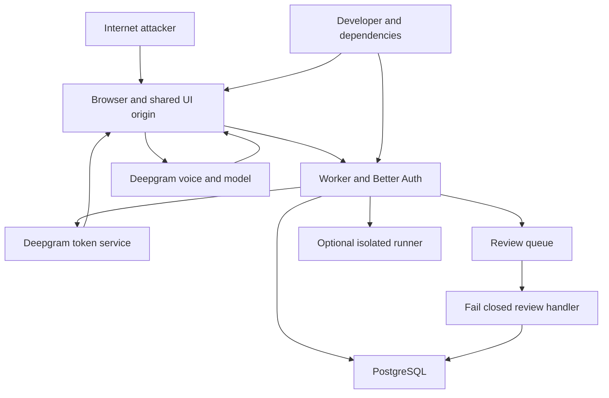

## Remediation status — 2026-09-16

The historical audit below describes revision `20b9793`. The subsequent security
change addresses SEC-001 through SEC-006 in source: route validation/escaping and
CSP; metered server-side voice relay; provider-origin transcript persistence;
exact-origin JSON writes; bounded input/history and serialized review dispatch;
and shared atomic PostgreSQL authentication throttling. Updated dependencies report
zero vulnerabilities in full and production-only npm audits.

Verification: 15 unit/contract tests; PostgreSQL concurrency and simulated-provider
relay tests; local Better Auth signup/session/revocation; migration invariants;
browser XSS/header regression; Home/Profile browser checks; lint/type/build checks;
and Wrangler deployment dry run. No real provider session or hosted deployment
was exercised. Apply migration 0003 before deploying. Production policy and hosted
configuration checks remain as described in the maintained architecture document.

## Historical threat-model executive summary

The planned production app exposes an evidence-led interview UI and cookie-authenticated API on one origin. The main established risks are malicious roadmap links executing script and authenticated clients obtaining unrestricted billable voice credentials. Browser-supplied voice evidence is not authenticated as provider output. Database ownership checks and fail-closed review generation reduce cross-user and model-related risks, but do not solve these browser and provider boundaries.

## Scope and assumptions

- Repository: `ai-interviewer`, revision `20b97934b637fb2cafff7a69ae954a051dea2d52`; audit date 2026-09-16.
- Owner confirmed: assess planned internet-facing production with personal collection enabled; ordinary interview practice only.
- In scope: `public/`, `src/`, migrations, build/local scripts, package/Worker configuration, and available Git history.
- External systems: Cloudflare, PostgreSQL, Deepgram and its model provider. Their hosted policies and configuration were not accessible for verification.
- Out of scope for execution: production penetration/load tests, real credentials, destructive data operations, and a runner implementation that is absent from this repository.
- Open questions: deployed edge protections, database role/TLS/backup policy, provider budgets/retention, and whether sibling origins host untrusted content. These affect conditional threat rankings.
- Confirmed source controls and gaps are separated from proposed production controls. No application fixes were made.

## System model

### Primary components

- Vanilla JavaScript demo and personal UI served from `public/`; `#personal` mounts the real adapter in the same origin (`public/app.js:278–282`).
- Cloudflare Worker serves assets and dispatches API/auth (`src/worker.ts:17–38`, `wrangler.jsonc`).
- Better Auth email/password and database sessions (`src/auth.ts:11–70`).
- PostgreSQL holds users, attempts, events, transcripts, checkpoints, runs, and reviews; transactions and membership triggers protect record relationships (`src/api.ts:61`, `migrations/0002_application.sql`).
- Browser connects directly to Deepgram using a short-lived token minted by the Worker; browser chooses voice-agent settings (`src/deepgram.ts:16`, `src/browser/voice-agent.js:49`).
- Review queue invokes a handler that currently publishes no model findings (`src/worker.ts:47`, `src/api.ts:538`). Optional Python execution uses a service binding; no runner deployment is configured in the checked-in Wrangler file (`src/api.ts:333`, `src/env.ts:16`).
- Local npm/esbuild/Wrangler/Drizzle tools build assets and manage development; committed design reference HTML is outside the deployed asset directory.

### Data flows and trust boundaries

- Internet link → browser document: URL fragment becomes route parameters and HTML; enum/output validation is incomplete for roadmap view. No local CSP blocked the reproduced injection (`public/roadmap.js:15–22`).
- Browser → Worker auth: HTTPS in planned production, email/password and session cookies; Better Auth trusted origin and database session checks. Actual hosted TLS/cookies and durable limiter remain unverified (`src/auth.ts:16–19,52`).
- Browser → personal API: cookies and JSON/plain-text-parsed JSON; owner filtering and field-type checks exist, custom write-origin checks and application resource allocations do not (`src/api.ts:471–535`, `src/http.ts:44`).
- Worker → PostgreSQL: parameterized queries via pg and optional Hyperdrive; operator supplies connection details. TLS and production least privilege are deployment assumptions (`src/database.ts:6–11`).
- Worker → Deepgram: fixed HTTPS grant endpoint with server credential; generic usage token returns to browser (`src/deepgram.ts:23–44`).
- Browser → Deepgram: provider WebSocket with audio, prompts, and settings; browser is untrusted and can change settings or use the bearer token elsewhere. No app-controlled connection lifecycle outside the official client.
- Browser → transcript persistence: arbitrary text, role and provider session ID; owner authenticated, provider authenticity absent (`src/api.ts:235–279`).
- Worker → queue → review handler: review ID sent through configured Cloudflare queue, database controls remain; processing fails closed and duplicate finish can dispatch again (`src/api.ts:375–403,538`).
- Worker → optional runner: source code and visible tests over service binding, response shape validated. Sandboxing, network restrictions, execution limits and runner access control cannot be verified here (`src/api.ts:333–373`).
- Developer/dependency registry → build artifacts → deployment: lockfile and pinned direct tooling, but transitive advisories present; hosted review/branch controls unverified.

#### Diagram

## Assets and security objectives

| Asset | Why it matters | Objective |
|---|---|---|
| Session and user account | Access to private attempts and ability to act as the user | C/I |
| Code and transcripts | Personal work and contextual conversation | C/I |
| Checkpoints, speaker provenance, assistance and findings | Honest evidence-led feedback and reproducibility | I |
| Deepgram credentials and budget | Prevent unauthorized provider use and service exhaustion | C/A |
| Database/queue capacity | Shared availability and predictable operating cost | A |
| Auth secrets and database credentials | Tenant isolation and account protection | C/I |
| Source, packages and build artifacts | Integrity of everything deployed | I |

## Attacker model

### Capabilities

Unauthenticated attackers can send links and auth requests. Registered users can create owned attempts, call the API outside the UI, edit client code, and reuse credentials returned to their browser. A compromised same-site sibling can issue credentialed requests if browser cookie rules permit. A compromised dependency/developer account can affect builds, but no such compromise was observed.

### Non-capabilities

An ordinary user cannot be assumed to know server credentials, control the fixed provider endpoint, change Worker bindings, query PostgreSQL directly, read other tenants through already scoped SQL, or invoke model tools that the application does not configure. Browser microphone permission is still required. The XSS proof did not bypass that permission. Do not treat a user asking their own interviewer to change behavior as cross-user compromise.

## Entry points and attack surfaces

| Surface | How reached | Boundary | Notes | Evidence |
|---|---|---|---|---|
| Static UI and hash routes | GET asset, fragment navigation | Link → DOM | Demonstrated XSS; shared personal origin | `public/roadmap.js:15–22`, `public/app.js:294` |
| Health and availability | GET `/api/health`, `/api/personal-availability` | Public → Worker | Non-secret capability metadata | `src/worker.ts:21–28` |
| Auth routes | `/api/auth/*` | Public → identity | Better Auth origin/cookies; memory limiter | `src/worker.ts:35`, `src/auth.ts` |
| Catalog | GET `/api/catalog` | Public → DB | Requires collection enabled, not sign-in; authored visible fields | `src/api.ts:151,482` |
| Identity/history/create | `/api/me`, `/api/attempts` | Cookie → owner data | No collection paging or quotas | `src/api.ts:483–490` |
| Attempt detail/draft | GET attempt, PATCH draft | Cookie → owner record | Owner predicate and revision check | `src/api.ts:493–500,309` |
| Messages/help/corrections | POST attempt subroutes | Client → evidence | Validation, but no common write-origin guard | `src/api.ts:505–534` |
| Voice token/transcript | POST attempt voice subroutes | App → provider/evidence | Generic token and unverified speaker source | `src/api.ts:509–515` |
| Run/finish/retry | POST attempt subroutes | Client → runner/queue/lineage | Runner optional; finish locks record; retry scopes source owner | `src/api.ts:333–429` |
| Review/related | GET attempt subroutes | Owner → derived data | Scoped through owned attempt | `src/api.ts:527–528` |
| Queue | Platform delivery | Queue → privileged worker | Unknown message shapes acknowledged; transient errors retry | `src/worker.ts:47–70` |
| Local tools | Developer commands | Local/registry → build/DB | Not internet runtime listeners by assumption | `scripts/`, `package.json` |

## Top abuse paths

1. **Account-data theft:** send encoded roadmap `view` payload → victim opens link → injected DOM handler runs → script uses same-origin personal API with victim cookies. Browser execution reproduced; real account theft intentionally not performed.
2. **Provider budget abuse:** register/create a voice attempt → request grants repeatedly → use tokens directly with alternate provider settings/endpoints → consume shared paid capacity. Generic token capabilities documented; paid abuse not exercised.
3. **Evidence forgery:** legitimate owner posts invented assistant text and providerSessionId → server records interviewer/coach speech → pending guidance becomes delivered → future review consumes misleading provenance. Actual handler reproduced with mocks.
4. **Cross-origin mutation:** compromise an eligible same-site sibling → send text/plain JSON or no-body voice grant request with ambient cookies → custom API lacks origin guard → user state/provider grant changes. Handler acceptance reproduced; sibling/cookie premise conditional.
5. **Shared resource exhaustion:** create many attempts/events or large payloads → full timeline/history reads and repeated finish dispatch amplify work → DB/queue/provider capacity consumed. No destructive load test.
6. **Distributed login abuse:** distribute guessing/sign-up across isolates → independent/resettable limiter counters → weaken intended auth throttling. Installed default verified; hosted compensating controls unknown.
7. **Development supply-chain exposure:** vulnerable transitive tool processes its affected input or serves a development directory → local compromise/disclosure affects deployment materials. Advisories exist; vulnerable input/serve path not established in the app.

## Threat model table

| Threat ID | Threat source | Prerequisites | Threat action | Impact | Impacted assets | Existing controls (evidence) | Gaps | Recommended mitigations | Detection ideas | Likelihood | Impact severity | Priority |
|---|---|---|---|---|---|---|---|---|---|---|---|---|
| TM-001 | Remote link sender | Victim opens crafted link; sign-in increases harm | Inject URL value into HTML | Execute as app origin | Session, private records | Personal renderer escaping; auth cookies (`personal-adapter.js:3`, auth library) | Unescaped roadmap view | Enum validation, context escaping, script CSP | CSP reports; malicious fragment regression | High: no extra interaction | High: private API authority | high |
| TM-002 | Registered abuser | Collection and paid voice enabled | Obtain generic grants and bypass UI settings | Unauthorized cost and contention | Provider budget | Owned attempt and temporary credential (`api.ts:509`) | No allocation or approved-session enforcement | Account/project budgets and controlled provider sessions | Grants versus provider use | High: user controls browser | High: shared paid resource | high |
| TM-003 | Attempt owner | Active voice attempt | Invent assistant transcript/session | Corrupt source provenance | Evidence integrity | Owner query; completion triggers | Provider origin not verified | Verified server stream or explicit unverified provenance | Unbound session IDs; provenance mismatch | High: ordinary API call | Medium: own evidence, reviews disabled | medium |
| TM-004 | Hostile eligible origin | Browser sends auth cookies | Submit unsafe requests | Unauthorized mutation | Attempts, budget | SameSite=Lax; auth-route origin guard | Custom API lacks equivalent check | Origin/CSRF and media-type validation | Rejected origin events without payload logs | Low: sibling/cookie prerequisite | Medium: no cross-origin read shown | medium |
| TM-005 | Registered abuser | Collection enabled | Grow inputs and repeat work | Service/storage pressure | DB, queue, runner capacity | Platform ceilings, parameterized SQL | No user budgets, paging, dispatch bounds | Workload-derived allocations and pagination | Per-user growth and queue lag | Medium: account required | Medium: workload dependent | medium |
| TM-006 | Remote auth attacker | Public auth; no effective edge limiter | Spread requests across isolates | Weaken brute-force defense | Accounts, auth availability | Built-in endpoint rules | In-memory counters and deployment-dependent enablement | Explicit durable/edge limiter and trusted client-IP configuration | Auth failures by account and trusted IP | Medium: deployment dependent | Medium: account abuse risk | medium |
| TM-007 | Malicious input/dependency actor | Vulnerable tooling path used or package compromised | Exploit local tool/build | Developer data/build compromise | Build integrity | Lockfile, local tooling boundaries | Advisories; hosted review controls unknown | Compatible updates, isolated tools, reviewed lockfile | Advisory checks and package-change review | Low: no affected runtime path found | Medium: developer context | low |

## Criticality calibration

- **Critical:** demonstrated server execution with deployment credentials, or unauthenticated bulk cross-user database access. Neither established.
- **High:** shared-origin script execution with signed-in API authority; unmetered use of the operator's paid voice resources. Both have concrete paths here.
- **Medium:** owner-generated forged provider evidence; conditional CSRF or distributed throttle weakness. Scope and prerequisites prevent treating these as universal account compromise.
- **Low:** dependency advisory without a reachable runtime path; authorship concentration in this young repository. Track these without presenting speculative exploits as findings.

## Focus paths for security review

| Path | Why it matters | Related threats |
|---|---|---|
| `public/roadmap.js` and `public/app.js` | Hash input → HTML and shared personal origin | TM-001 |
| `src/api.ts` | Owner checks, write policies, evidence and cost-triggering actions | TM-002–TM-005 |
| `src/deepgram.ts` and `src/browser/voice-agent.js` | Bearer grant scope and browser-controlled provider connection | TM-002, TM-003 |
| `src/auth.ts` | Origin, cookies and durable brute-force protection | TM-004, TM-006 |
| `src/http.ts` | Request parsing and input-size boundary | TM-004, TM-005 |
| `migrations/0002_application.sql` | Evidence membership, completion and authorized deletion design | TM-003, TM-005 |
| `src/database.ts`, `wrangler.jsonc` | Privileged service boundaries and deployment assumptions | TM-005, TM-006 |
| `package-lock.json`, `scripts/` | Tooling exposure, credential handling and build trust | TM-007 |

## Notes on use

- Existing mitigations above were inspected; recommendations are not implemented.
- See `security_best_practices_report.md` for reproducible evidence, source lines and dependency citations.
- Coverage check: discovered route families, static assets, auth, queue and optional runner are included; browser/provider/database/build boundaries are represented; runtime and local tooling are separated; owner clarifications and open deployment questions are explicit.
- The collection gate must stay closed until the approved retention, deletion/export and processor policy has a working implementation. This audit does not approve a policy or certify a provider contract.
- Ponytail rule applied: retain current ownership checks, safe SQL and fail-closed review behavior; recommend only controls tied to concrete abuse paths. No speculative agent framework, scanner platform, or replacement auth stack is proposed.
