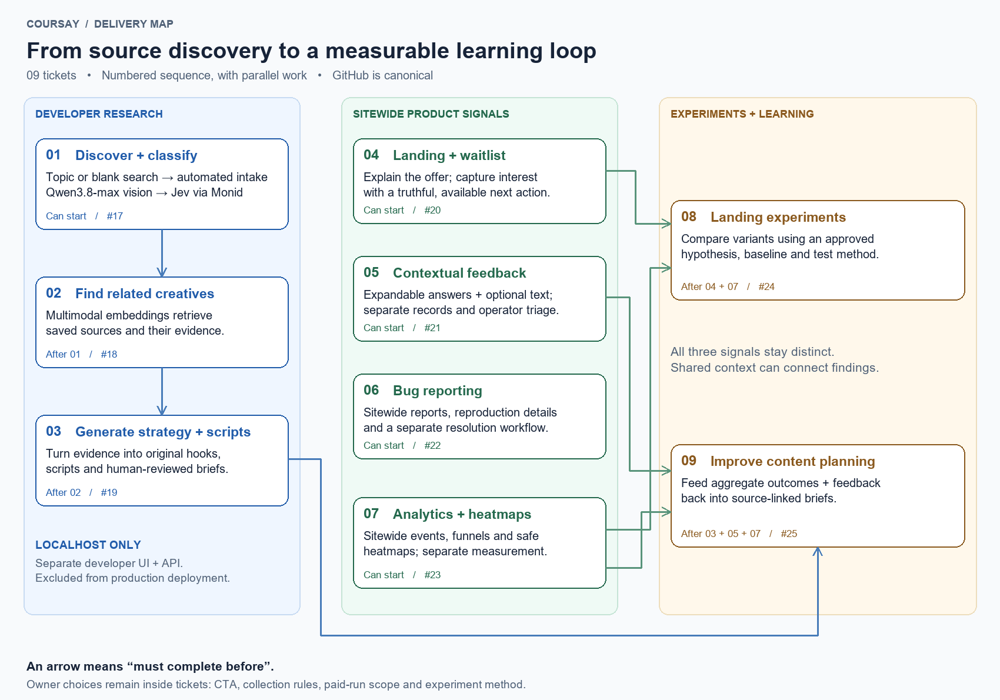

# Coursay · ticket map
**Developer research → sitewide signals → measured improvement**

> **Historical planning record:** preserved on 2026-10-06. Original status and proposed decisions may be superseded; use the linked GitHub issues for current work.
> **Scope:** research UI/API stays localhost-only. Feedback, bugs and analytics cover the customer site.

[✏️ Editable Excalidraw source](marketing-ticket-map.excalidraw) · [Full-size diagram](marketing-ticket-map.png)

## Workstreams

| 🔵 Developer research | 🟢 Sitewide product signals | 🟠 Experiments + learning |
|---|---|---|
| 01 → 02 → 03 | 04 · 05 · 06 · 07 | 08 · 09 |
| Automated discovery, evidence, retrieval, briefs | Separate feedback, bug and analytics workflows | Controlled comparisons and improved planning |

## Tickets

| Order | Issue / outcome | Depends on |
|:---:|---|:---:|
| **01** | [Discover + classify · #17](https://github.com/ai-interviewer-platform/ai-interviewer/issues/17) — Topic or blank search → automated intake Qwen3.8-max vision → Jev via Monid | — |
| **02** | [Find related creatives · #18](https://github.com/ai-interviewer-platform/ai-interviewer/issues/18) — Multimodal embeddings retrieve saved sources and their evidence. | 01 |
| **03** | [Generate strategy + scripts · #19](https://github.com/ai-interviewer-platform/ai-interviewer/issues/19) — Turn evidence into original hooks, scripts and human-reviewed briefs. | 02 |
| **04** | [Landing + waitlist · #20](https://github.com/ai-interviewer-platform/ai-interviewer/issues/20) — Explain the offer; capture interest with a truthful, available next action. | — |
| **05** | [Contextual feedback · #21](https://github.com/ai-interviewer-platform/ai-interviewer/issues/21) — Expandable answers + optional text; separate records and operator triage. | — |
| **06** | [Bug reporting · #22](https://github.com/ai-interviewer-platform/ai-interviewer/issues/22) — Sitewide reports, reproduction details and a separate resolution workflow. | — |
| **07** | [Analytics + heatmaps · #23](https://github.com/ai-interviewer-platform/ai-interviewer/issues/23) — Sitewide events, funnels and safe heatmaps; separate measurement. | — |
| **08** | [Landing experiments · #24](https://github.com/ai-interviewer-platform/ai-interviewer/issues/24) — Compare variants using an approved hypothesis, baseline and test method. | 04, 07 |
| **09** | [Improve content planning · #25](https://github.com/ai-interviewer-platform/ai-interviewer/issues/25) — Feed aggregate outcomes + feedback back into source-linked briefs. | 03, 05, 07 |

> **Parallel starts:** 01, 04, 05, 06, 07. Arrows show real blockers; numbering is not a mandatory serial queue.

## Boundaries that matter

- **Research:** user starts a topic or blank search; acquisition and analysis then automate. Manual import supplements discovery.
- **Qwen3.8-max → Jev:** Qwen3.8-max extracts evidence; Jev classifies it. Embeddings retrieve related sources; the generative model writes briefs.
- **Independent sitewide signals:** separate records and triage; shared approved context permits correlation.
- **Live-use decisions:** CTA, collection/retention/contact rules, paid-run scope and experiment method remain explicit acceptance gates.

GitHub issues are canonical. Closed planning/specification issues remain linked historical references.

**Edit:** open the .excalidraw file in Excalidraw. The PNG is the Markdown preview; re-export it after editing the drawing.
