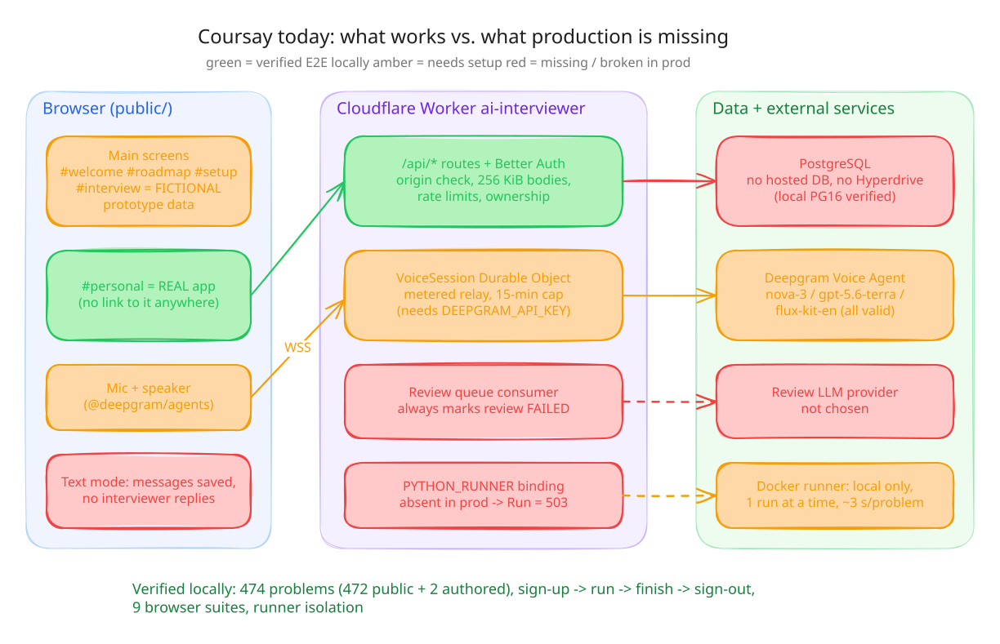
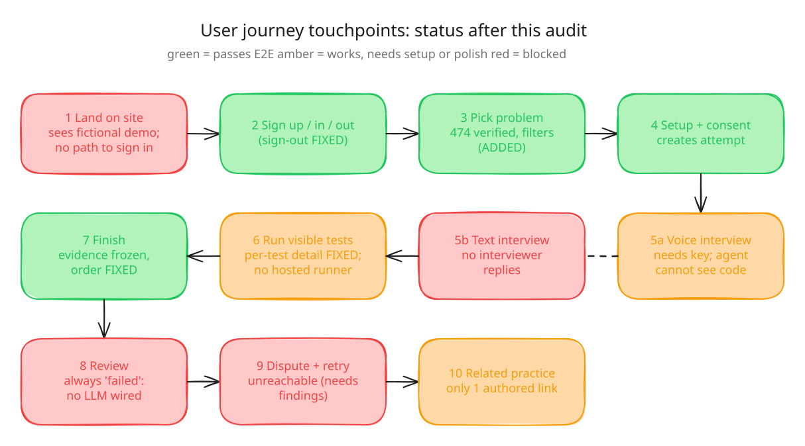
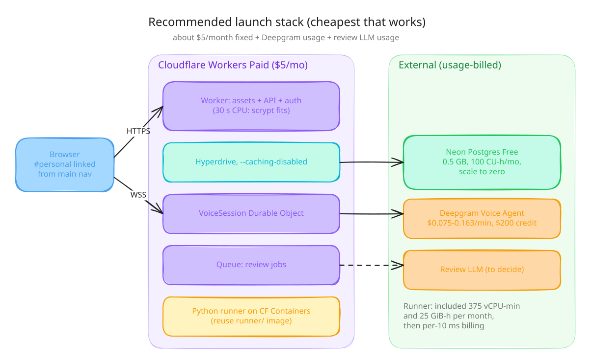

# Launch readiness audit (2026-09-24)

Scope: every automated suite in the repository, a new signed-in browser journey
against a live local stack, live Docker runner execution of the whole problem
bank, and configuration review of Deepgram, Cloudflare, and database hosting.
[Product and architecture](product-and-architecture.md) remains authoritative
for the product contract.

## Verdict

The code that exists is in good shape: security controls, evidence invariants,
runner isolation, and auth all pass against real PostgreSQL 16, Docker, and
workerd. It is **not ready for live users** yet. Four core pieces are missing in
production, not merely unconfigured: a database connection, a hosted Python
runner, an interviewer for text mode, and a review generator. The polished UI
is also a fictional prototype; the real app lives at `#personal`, and nothing
links to it.





Editable sources are the `.excalidraw` files in [`diagrams/`](diagrams/); open
one at excalidraw.com, edit it, and export SVG with the same name.

## What was run

| Suite | Result |
| --- | --- |
| `npm test` (26 unit/contract tests) | Pass |
| `npm run check`, `npm run lint`, `wrangler deploy --dry-run` | Pass |
| Migrations applied twice (idempotent) + `scripts/verify-postgres.mjs` | Pass |
| `test/security-integration.mjs` (quotas, voice relay, dispatch, concurrency) | Pass |
| `npm run test:runner` (17 real-container isolation tests) | Pass |
| `npm run test:runner:api` (API → controller → Docker → PostgreSQL) | Pass |
| `scripts/verify-better-auth-local.mjs` (sign-up, session, revocation) | Pass |
| `npm run runner:smoke` (live Worker service binding) | Pass |
| 8 existing browser suites incl. axe WCAG 2.2 AA on 30 screens, 320–1440 px | Pass |
| New `test/browser/personal-flow-check.mjs` (real sign-up → run → finish → sign-out, axe) | Pass |
| `scripts/problem-bank/verify-runner.mjs` (every bank problem through the real Docker runner) | Pass: all 474 active problems' reference solutions pass; no untouched starter code passes |

Not testable here: live Deepgram audio (no key; provider traffic is simulated in
`security-integration.mjs`) and the deployed Worker.

## Fixed in this change

| Area | Problem | Fix |
| --- | --- | --- |
| Auth | Sign-out always failed with 415: Better Auth 1.7 requires a JSON content type | Send an empty JSON body |
| Problems | Seeded starter code stored a literal `\n`, so every attempt began with a `SyntaxError` | `0004_seed_newlines.sql` |
| Problems | Only 2 problems | 472 verified MBPP/HumanEval problems (`0005_problem_bank.sql`) with topic/difficulty filters |
| Runner | Contract accepted only one list argument | Adds `positional JSON arguments` (0–16 JSON values), keeps the original contract |
| Workspace | Results showed only counts; no inputs, expected/actual values, errors, or output | Per-test results and stdout/stderr for visible tests |
| Workspace | Run/finish confirmation disappeared immediately; double-click could queue duplicate runs | Message shown after refresh; button disabled while running |
| Evidence | Client offsets restarted on every refresh, so the timeline misordered messages, runs, and help | Offsets measured from attempt creation, monotonic per page |
| Navigation | "← Sessions" and "← Back to home" sent signed-in users to the fictional demo home and discarded unsaved code | In-app navigation that saves the draft and refreshes history |
| Setup | Real consent checkbox threw a page error from prototype code | Guarded handler |
| Accessibility | `--ink-3` text failed WCAG AA contrast in both themes (3.2–4.3:1); workspace switch overflowed at 320 px | Tokens raised to ≥ 4.5:1; switch buttons shrink |
| Tests | Browser suites required Microsoft Edge, raced cancelled logo animations and drawer opening, and asserted a removed footnote | Shared launcher with Chromium fallback and deterministic waits |

## Launch blockers

| # | Blocker | Who | Cheapest fix |
| --- | --- | --- | --- |
| 1 | No hosted database: no Hyperdrive config exists and `wrangler.jsonc` has no `HYPERDRIVE` binding, so every personal route in the deployed Worker returns 503 | You (accounts), then config | Neon Free + Hyperdrive, **caching disabled** (runbook below) |
| 2 | No hosted Python runner: without `PYTHON_RUNNER`, **Run visible tests** returns 503. The local controller runs one job at a time (~3 s per 3-test run) and must not be exposed | Code | Workers Paid + Cloudflare Containers/Sandbox running the existing `runner/` harness; about 1 container per run |
| 3 | Reviews never produce findings: `processReview` marks every review `failed`, so review, dispute, and retry-from-checkpoint are unreachable | Decision, then code | Pick an LLM, implement structured findings that cite `attempt_events` IDs |
| 4 | Text mode has no interviewer: messages are stored, nobody replies | Decision, then code | Reuse the review LLM for text turns, or make voice the only interview mode at launch |
| 5 | Real app is unreachable: only `/#personal` is real; the main screens show prepared data ("preview", "Prepared code · read-only") | Product decision | Minimum: add Sign in → `#personal` to the main nav; later wire the designed screens to the API |
| 6 | `PERSONAL_DATA_COLLECTION_APPROVED=false` by design; disclosure version is `pending-owner-data-policy`; no real export or deletion; no password reset or email verification | You (policy), then code | Publish privacy terms, add account deletion, and add email via a provider before inviting strangers |

## Should fix soon after

- Voice: the agent cannot see the candidate's code or test results; there is no
  `agent.greeting`, so the candidate must speak first. `gpt-5.6-terra` is valid
  but is Deepgram's **Advanced** tier ($0.163/min). `gpt-5.6-luna` is Standard
  ($0.075/min). At the configured 600-minute daily project cap, worst case is
  about $98/day on terra versus $45/day on luna.
- Hidden tests are stored but never executed; finishing does not grade.
- The catalog returns all problems in one response (≈330 KB, 52 KB gzipped);
  add pagination before the bank grows much further.
- Review CC BY attribution for MBPP in the product's legal page.
- Auth: session revocation relies on uncached reads (see Hyperdrive below).

## Architecture assessment

Keep the architecture. Cloudflare Workers + Durable Objects + Queues +
PostgreSQL is a sound, inexpensive fit, and the code already targets Hyperdrive
(`src/database.ts`). A D1 migration is not worthwhile: the schema depends on
plpgsql triggers, `FOR UPDATE`, and `pg_advisory_xact_lock`. The transaction-level
advisory lock is compatible with Hyperdrive's transaction pooling.



| Piece | Recommendation | Monthly cost |
| --- | --- | --- |
| Workers plan | **Paid.** Free allows 10 ms CPU per request; native scrypt sign-in costs more, and Containers need Paid | $5 |
| Database | Neon Free (0.5 GB, 100 CU-hours, scales to zero, no weekly pause like Supabase Free) | $0 to start |
| Pooling | Hyperdrive (included) with `--caching-disabled` | $0 |
| Queue, Durable Objects | Included allowances cover an MVP | $0 |
| Python runner | Cloudflare Containers: 375 vCPU-min and 25 GiB-h included, then per-10 ms billing. Alternatives: E2B ($100 one-time credit), Modal ($30/mo credit); the public Piston API is closed | ~$0 at MVP volume |
| Voice | Deepgram pay-as-you-go, $200 starting credit | usage |

Hyperdrive caches read queries for 60 seconds by default and does not
invalidate on writes. With caching on, draft revisions would return stale (409
conflicts), new runs would not appear, and signed-out sessions could remain
valid for a minute. Create the config with caching disabled.

## Manual runbook

1. **Cloudflare plan**: upgrade the account to Workers Paid.
2. **Database**: create a Neon project in the region nearest your users and copy
   the direct (non-pooled) connection string with `sslmode=require`.
3. **Schema and data** from a trusted machine. The problem bank needs a runner
   that accepts the `positional JSON arguments` contract; deploy or restart the
   runner before exposing these problems, or every run returns 503.
   ```sh
   DATABASE_URL='postgresql://…neon.tech/neondb?sslmode=require' npm run migrate:postgres
   DATABASE_URL='…' node scripts/verify-postgres.mjs   # transactional; rolls back its fixtures
   ```
4. **Hyperdrive**:
   ```sh
   npx wrangler hyperdrive create ai-interviewer-db --connection-string='postgresql://…' --caching-disabled
   ```
   Add the returned ID to `wrangler.jsonc`:
   ```jsonc
   "hyperdrive": [{ "binding": "HYPERDRIVE", "id": "<id>" }],
   "vars": { "BETTER_AUTH_URL": "https://<your-domain>", "PERSONAL_DATA_COLLECTION_APPROVED": "false" }
   ```
5. **Queue and secrets**:
   ```sh
   npx wrangler queues create ai-interviewer-review   # skip if it already exists
   npx wrangler secret put BETTER_AUTH_SECRET          # openssl rand -base64 48
   npx wrangler secret put DEEPGRAM_API_KEY
   ```
6. **Deploy and smoke-test**: `npm run build:voice && npx wrangler deploy`, then
   `GET /api/health` and `GET /api/personal-availability`. Flip
   `PERSONAL_DATA_COLLECTION_APPROVED` to `"true"` only after blocker 6 is resolved.
7. **Deepgram**: create a project key limited to Voice Agent usage and set a
   billing alert; consider `gpt-5.6-luna` to halve per-minute cost.

## Local verification setup used for this audit

Linux has no PostgreSQL or Edge paths assumed by the scripts, so the audit used
PostgreSQL 16 on port 5433, `PLAYWRIGHT_EXECUTABLE_PATH` for the preinstalled
Chromium, and a Docker Hub mirror for the runner base image after an anonymous
pull-rate limit.
